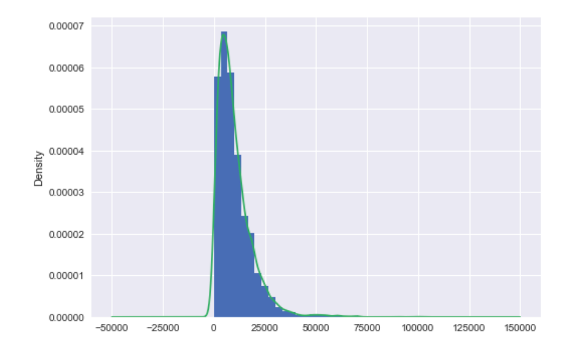
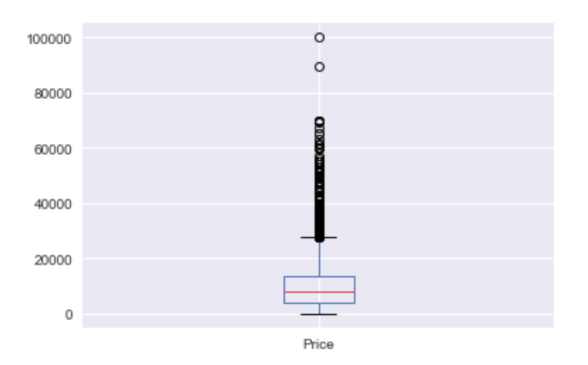
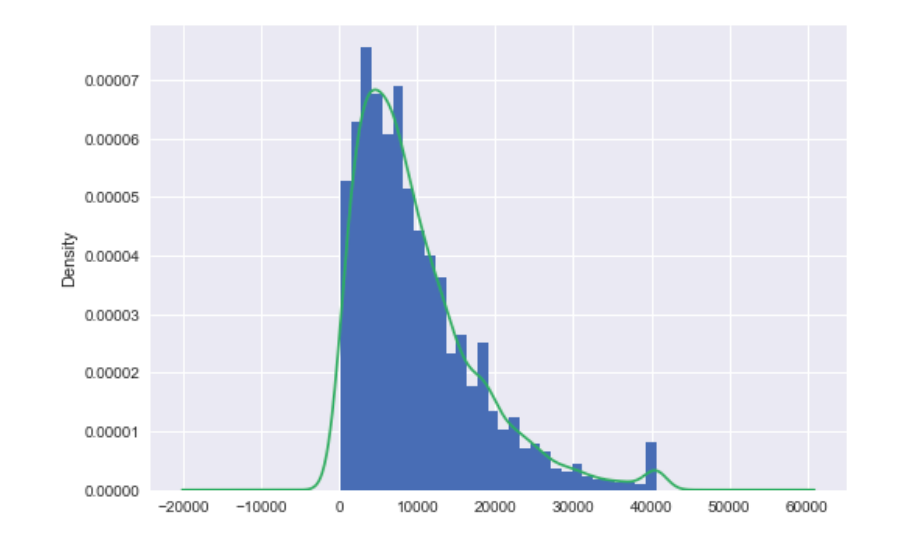
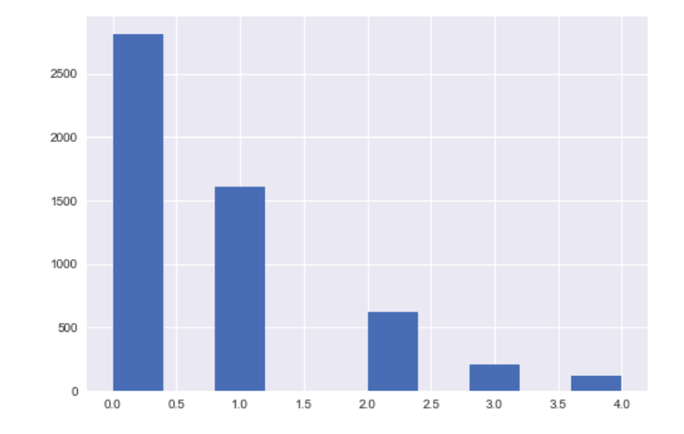
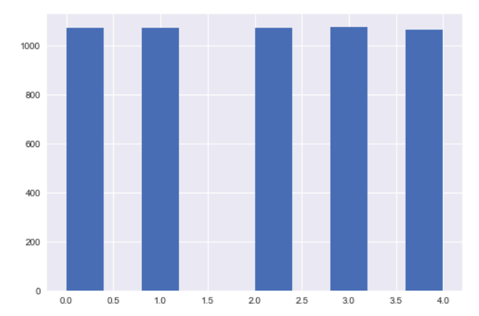
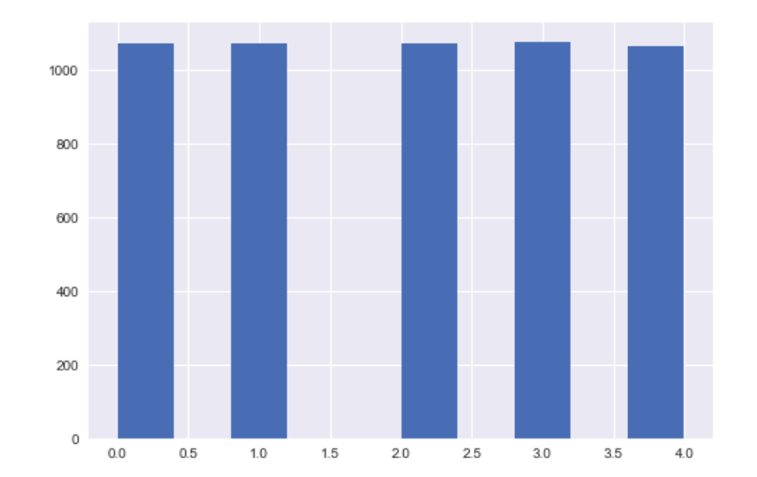

# 数据预处理

导库，读取数据

```python
import numpy as np
import pandas as pd
df = pd.read_csv('../data/MotorcycleData.csv',encoding='gbk',na_values='Na')
```

### 1.重复值处理·对价格和里程数数据进行处理

自定义函数,把价格中的美元符号、逗号、里程数逗号去掉；

```python
def f(x):
    if '$' in str(x):
        x = str(x).strip('$')
        x = str(x).replace(',','')
    else:
        x = str(x).replace(',','')
    return float(x)
#价格处理
df['Price'] = df['Price'].apply(f)
#里程处理
df['Mileage'] = df['Mileage'].apply(f)
```

查看是否有重复数据

```python
>>> print('数据是否存在重复观测:\n',any(df.duplicated()))
数据是否存在重复观测:
 True
```

查看重复数据

```python
df[df.duplicated()]
```

计算重复数量

```python
np.sum(df.duplicated())
```

删除所有变量都重复的行，注意：这里没有inplace=True

```python
df.drop_duplicates()
```

按照两个变量重复来去重

```python
df.drop_duplicates(subset=['Condition','Condition_Desc','Price','Location'],inplace=True)
```

### 2.缺失值处理

查看缺失比率

```python
df.apply(lambda x : sum(x.isnull()) / len(x),axis=0)
```

删除法——直接删除(慎重)

```python
df.dropna()
```

只要有缺失，就删除这一列

```python
df.dropna(how='any',axis=1)
```

只有有缺失，就删除这一行

```python
df.dropna(how='any',axis=1)
```

基于某些变量，有缺失值，就删除行或者列；axis=0 或者1 代表的函数在数据集作用的方向，0代表沿着行的方向，1代表沿着列的方向；

```python
df.dropna(axis=0,how='any',subset=['Condition','Price','Mileage'])
```

替换法——

在数据分析中，大部分按照行来删除，很少基于列删除；列代表变量，是否删除列，很多时候取决于缺失比例

年量用均值填补

```python
df.Mileage.fillna(df.Mileage.mean())
```

中位数填补

```python
df.Mileage.fillna(df.Mileage.median())
```

众数填补

```python
df.Exterior_Color.fillna(df.Exterior_Color.mode()[0])
```

所有缺失值用20填补

```python
df.fillna(20)
```

分类填补：车颜色-众数，里程-均值

```python
df.fillna(value={'Exterior_Color':df.Exterior_Color.mode()[0],'Mileage':df.Mileage.mean()})
```

前向填补

```python
df['Exterior_Color'].fillna(method='ffill')
```

后向填补

```python
df['Exterior_Color'].fillna(method='bfill')
```

### 3.异常值处理

- 异常值检测可以使用均值得倍标准差范围，也可以使用上下4分位数差方法

常值检测之标准差法

```python
xbar = df.Price.mean()
xstd = df.Price.std()
print('标准差法异常值上线检测:\n',any(df.Price > xbar + 2.5 * xstd))
print('标准差法异常值下线检测:\n',any(df.Price < xbar - 2.5 * xstd))

标准差法异常值上线检测:
 True
标准差法异常值下线检测:
 False
```

异常值检测之箱线图法

```python
Q1 = df.Price.quantile(q=0.25)
Q3 = df.Price.quantile(q=0.75)
IQR = Q3 - Q1
print('标准差法异常值上线检测:\n',any(df.Price > Q3 + 1.5 * IQR))
print('标准差法异常值下线检测:\n',any(df.Price < Q1 - 1.5 * IQR))

标准差法异常值上线检测:
 True
标准差法异常值下线检测:
 False
```

绘图

```python
#倒入绘图模块
import matplotlib as plt
%matplotlib inline
#设置绘图风格
plt.style.use('seaborn')
#绘制直方图
df.Price.plot(kind='hist',bins=30,density=True)
#绘制核密度图
df.Price.plot(kind='kde')
#图形展现
plt.legend
```




箱图

```python
#导入绘图模块
import matplotlib as plt
%matplotlib inline
df.Price.plot(kind='box')
```



```python
#用99分位数和1分位数替换
#计算P1和P99
P1 = df.Price.quantile(0.01);
P99 = df.Price.quantile(0.99)

#先创建一个新变量，进行赋值，然后将满足条件的数据进行替换
df['Price_new'] = df['Price']
df.loc[df['Price'] > P99,'Price_new'] = P99
df.loc[df['Price'] < P1,'Price_new'] = P1
```

```python
#导入绘图模块
import matplotlib as plt
%matplotlib inline
#设置绘图风格
plt.style.use('seaborn')
#绘制直方图
df.Price_new.plot(kind='hist',bins=30,density=True)
#绘制核密度图
df.Price_new.plot(kind='kde')
#图形展现
plt.legend
```



### 4.数据离散化

- pandas.cut(x, bins, right=True, labels=None, retbins=False, precision=3, include_lowest=False)
- 参数：
    - x，类array对象，且必须为一维，待切割的原形式
    - bins, 整数、序列尺度、或间隔索引。如果bins是一个整数，它定义了x宽度范围内的等宽面元数量，但是在这种情况下，x的范围在每个边上被延长1%，以保证包括x的最小值或最大值。如果bin是序列，它定义了允许非均匀bin宽度的bin边缘。在这种情况下没有x的范围的扩展。
    - right,布尔值。是否是左开右闭区间，right=True,左开右闭,right=False,左闭右开
    - labels,用作结果箱的标签。必须与结果箱相同长度。如果FALSE，只返回整数指标面元。
    - retbins,布尔值。是否返回面元
    - precision，整数。返回面元的小数点几位
    - include_lowest，布尔值。第一个区间的左端点是否包含

```python
df['Price_bin'] = pd.cut(df['Price_new'],5,labels=range(5))
df['Price_bin'].hist()
```



自定义分段标准和标签·cut

```python
w = [100,1000,5000,10000,20000,50000]
df['Price_bin1'] = pd.cut(df['Price_new'],bins=w,labels=['低','便宜','划算','中等','高'],right=False)

df['Price_bin1'].value_counts()
划算    1651
中等    1494
便宜    1421
高      555
低      235
Name: Price_bin1, dtype: int64
```

- pandas.qcut(x, q, labels=None, retbins=False, precision=3, duplicates=’raise’)
- 参数：
    - x
    - q,整数或分位数组成的数组。
    - q, 整数 或分位数数组 整数比如 4 代表 按照4分位数 进行切割
    - labels, 用作结果箱的标签。必须与结果箱相同长度。如果FALSE，只返回整数指标面元。
- 原理都是基于分位数来进行离散化

```python
k = 5
w = [1.0*i/k for i in range(k+1)]
w

df['Price_bin2'] = pd.qcut(df['Price_new'],w,labels=range(k))
df['Price_bin2'].hist()
```



先计算分位数的值

```python
k = 5
#先计算中位数，再进行分段
w1 = df['Price_new'].quantile([1.0*i/k for i in range(k+1)])
#最小值缩小一点
w1[0] = w1[0] * 0.95
#最大值增大一点,目的为了确保数据在这个范围内
w[-1] = w1[1]*1.05

df['Price_bin4'] = pd.cut(df['Price_new'],w1,labels=range(k))
df['Price_bin'].hist()
```




